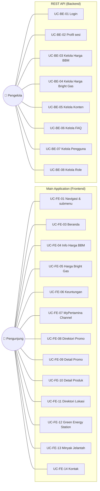

# Dokumen Use Case — MyPertamina Clone

**Modul:** Main Application (Frontend) & REST API (Backend)
**Versi:** 1.0
**Tanggal:** 5 Juli 2026
**Status:** Draft untuk review

---

## 1. Pendahuluan

### 1.1 Tujuan

Dokumen ini menjelaskan **use case** (kasus penggunaan) dari aplikasi **MyPertamina Clone** pada dua modul yang telah dikembangkan, yaitu:

1. **Main Application (Frontend)** — aplikasi web publik yang diakses pengunjung.
2. **REST API (Backend)** — layanan API yang menyediakan dan mengelola data.

Dokumen ini menjadi acuan bersama antara tim pengembang, penguji (QA), dan pembimbing magang untuk memahami cakupan fungsional sistem yang sudah berjalan.

### 1.2 Ruang Lingkup

- ✅ **Termasuk:** Main Application (Frontend) dan REST API (Backend).
- ❌ **Tidak termasuk:** Content Management System (CMS). Modul CMS **belum dikembangkan**, sehingga tidak dicakup dalam dokumen versi ini. Antarmuka pengelolaan (CMS) yang akan mengonsumsi endpoint terproteksi pada Backend merupakan pekerjaan mendatang.

### 1.3 Referensi

| Dokumen | Lokasi |
| --- | --- |
| Panduan Gaya Visual Frontend | `docs/style.md` |
| Dokumentasi umum proyek | `README.md`, `backend/README.md` |
| Skema basis data | `backend/src/db/schema.sql` |

---

## 2. Definisi, Istilah, dan Singkatan

| Istilah | Penjelasan |
| --- | --- |
| **BBM** | Bahan Bakar Minyak (Pertalite, Pertamax, Pertamax Turbo, Pertamina Dex, Dexlite, dll.) |
| **SPBU** | Stasiun Pengisian Bahan Bakar Umum |
| **GES** | Green Energy Station — SPBU berkonsep ramah lingkungan |
| **SPKLU** | Stasiun Pengisian Kendaraan Listrik Umum |
| **SPBKLU** | Stasiun Penukaran Baterai Kendaraan Listrik Umum |
| **UCO** | Used Cooking Oil (minyak jelantah) |
| **JWT** | JSON Web Token — mekanisme autentikasi berbasis token |
| **RBAC** | Role-Based Access Control — kontrol akses berbasis peran |
| **Rich Text (HTML)** | Konten berformat (heading, paragraf, tebal, daftar, tautan) yang disimpan sebagai HTML |
| **FTZ** | Free Trade Zone — kawasan perdagangan bebas |

---

## 3. Arsitektur Ringkas

```
┌──────────────────────┐        HTTP / REST (JSON)        ┌──────────────────────┐
│   Main Application    │  ───────────────────────────▶   │      REST API         │
│   (Frontend)          │                                  │      (Backend)        │
│   Nuxt 4 / Vue 3      │  ◀───────────────────────────   │      Express.js       │
└──────────────────────┘                                  └───────────┬──────────┘
                                                                       │ mysql2
                                                                       ▼
                                                              ┌──────────────────┐
                                                              │      MySQL        │
                                                              └──────────────────┘
```

- **Frontend:** Nuxt 4 (Vue 3), rendering SSR + hydration; memanggil Backend melalui composable `useApi`.
- **Backend:** Express.js; autentikasi **JWT**; otorisasi **RBAC** (`requireAuth` + `requirePermission`).
- **Basis data:** MySQL (diakses melalui driver `mysql2`).

---

## 4. Aktor

| Aktor | Tipe | Deskripsi |
| --- | --- | --- |
| **Pengunjung** | Utama (Frontend) | Pengguna umum tanpa autentikasi. Mengakses seluruh halaman publik Main Application. |
| **Pengelola** | Utama (Backend) | Pengguna terautentikasi yang memegang *permission* tertentu (mis. Super Admin). Mengakses endpoint terproteksi pada REST API. **Catatan:** karena CMS belum ada, aktor ini saat ini berinteraksi langsung dengan REST API (mis. melalui klien HTTP), bukan melalui antarmuka grafis. |
| **Frontend (Sistem)** | Pendukung | Aplikasi Nuxt yang bertindak sebagai konsumen (*consumer*) endpoint publik REST API atas nama Pengunjung. |

> Peran (role) bawaan hasil seed: **Super Admin** (semua permission), **Content Editor** (`price.view`, `content.view`, `content.manage`), **Price Manager** (`price.view`, `price.update`). Peran bersifat dinamis dan dapat dikelola melalui endpoint Role Management.

---

## 5. Daftar Use Case

### 5.1 Frontend — Aktor: Pengunjung

| ID | Nama Use Case | Halaman |
| --- | --- | --- |
| UC-FE-01 | Menjelajahi navigasi utama dan submenu | Semua halaman (Header) |
| UC-FE-02 | Membuka drawer bertingkat Subsidi Tepat & menuju portal eksternal | Semua halaman (Header) |
| UC-FE-03 | Melihat Beranda (harga BBM, banner, promo, berita) | `/` |
| UC-FE-04 | Melihat tabel Informasi Harga BBM per provinsi | `/about/product-price` |
| UC-FE-05 | Melihat & mencari Informasi Harga Jual Bright Gas | `/about/bright-gas-price` |
| UC-FE-06 | Melihat halaman Keuntungan MyPertamina | `/about/keuntungan-mypertamina` |
| UC-FE-07 | Melihat halaman MyPertamina Channel | `/about/mypertamina-channel` |
| UC-FE-08 | Menelusuri direktori Program & Promo (filter + pencarian) | `/promo-event` |
| UC-FE-09 | Melihat detail Promo & membagikannya | `/promo-event/{slug}` |
| UC-FE-10 | Melihat halaman detail Produk BBM | `/product/{category}/{slug}` |
| UC-FE-11 | Mencari & menelusuri direktori Lokasi (SPBU/GES/Bright/LPG) | `/spbu-location/{channel}` |
| UC-FE-12 | Melihat halaman Sustainability — Green Energy Station | `/sustainability/green-energy-station` |
| UC-FE-13 | Melihat halaman Sustainability — Kumpulkan Minyak Jelantah | `/sustainability/kumpulkan-minyak-jelantah` |
| UC-FE-14 | Menghubungi (FAQ, kontak, peta, salin nomor, kirim email) | `/contact` |

### 5.2 Backend — Aktor: Pengelola (via REST API)

| ID | Nama Use Case | Permission |
| --- | --- | --- |
| UC-BE-01 | Login dan memperoleh token akses | — (publik) |
| UC-BE-02 | Mengambil profil sesi aktif | Terautentikasi |
| UC-BE-03 | Mengelola Harga BBM (tambah/ubah/hapus) | `price.update` |
| UC-BE-04 | Mengelola Harga Bright Gas per provinsi | `price.update` |
| UC-BE-05 | Mengelola Konten (promo/banner/berita) | `content.manage` |
| UC-BE-06 | Mengelola FAQ | `content.manage` |
| UC-BE-07 | Mengelola Pengguna | `user.manage` |
| UC-BE-08 | Mengelola Role & Permission | `role.manage` |

> **Endpoint baca (GET) yang bersifat publik** — harga BBM, harga Bright Gas, produk, lokasi, konten, statistik fasilitas, lokasi UCO, dan FAQ — dikonsumsi oleh Frontend dan tidak memerlukan autentikasi. Rincian pada **Bagian 8 (Referensi Endpoint API)**.

---

## 6. Diagram Use Case



---

## 7. Spesifikasi Use Case Rinci

> Format tiap use case: **Aktor**, **Deskripsi**, **Prakondisi**, **Pemicu**, **Alur Utama**, **Alur Alternatif / Eksepsi**, **Pascakondisi**, **Sumber Data / Endpoint**.

### 7.1 Frontend (Main Application)

---

#### UC-FE-01 — Menjelajahi navigasi utama dan submenu

- **Aktor:** Pengunjung
- **Deskripsi:** Pengunjung menggunakan header untuk berpindah antarhalaman. Menu tertentu (Tentang MyPertamina, Produk, Lokasi, Sustainability) menampilkan panel submenu (dropdown) saat di-*hover*/klik.
- **Prakondisi:** Pengunjung membuka salah satu halaman yang memuat komponen Header.
- **Pemicu:** Pengunjung mengarahkan kursor/mengklik item menu.
- **Alur Utama:**
  1. Sistem menampilkan header dengan logo dan daftar menu utama.
  2. Pengunjung meng-*hover*/klik menu bertanda panah bawah.
  3. Sistem menampilkan panel submenu berisi tautan spesifik.
  4. Pengunjung mengklik salah satu tautan.
  5. Sistem melakukan navigasi (client-side routing) ke halaman tujuan.
- **Alur Alternatif / Eksepsi:**
  - 3a. Pengunjung menutup panel dengan tombol tutup atau mengklik area gelap (overlay), lalu panel menutup kembali.
- **Pascakondisi:** Halaman tujuan tampil.
- **Sumber Data / Endpoint:** — (navigasi lokal, tanpa API)

---

#### UC-FE-02 — Membuka drawer bertingkat Subsidi Tepat & menuju portal eksternal

- **Aktor:** Pengunjung
- **Deskripsi:** Menu **Subsidi Tepat** menampilkan panel dua tingkat (drawer): tingkat pertama berisi kategori (**Subsidi Tepat BBM**, **Subsidi Tepat LPG 3kg**), tingkat kedua berisi tautan detail.
- **Prakondisi:** Header tampil.
- **Pemicu:** Pengunjung mengklik menu "Subsidi Tepat".
- **Alur Utama:**
  1. Sistem menampilkan drawer tingkat pertama dan overlay gelap.
  2. Pengunjung memilih kategori "Subsidi Tepat BBM".
  3. Sistem menyorot kategori terpilih dan menampilkan drawer tingkat kedua berisi 3 tautan.
  4. Pengunjung mengklik "Pendaftaran Subsidi Tepat BBM" / "FAQ Subsidi Tepat BBM".
  5. Sistem membuka tab baru (`target="_blank"`) ke portal resmi `subsiditepat.mypertamina.id`.
- **Alur Alternatif / Eksepsi:**
  - 2a. Pengunjung memilih "Subsidi Tepat LPG 3kg"; isi drawer kedua berganti menampilkan "FAQ Subsidi Tepat LPG" (tautan eksternal `subsiditepatlpg.mypertamina.id`).
  - 3a./4a. Pengunjung menutup drawer melalui tombol tutup atau overlay; seluruh panel tertutup.
- **Pascakondisi:** Tab eksternal terbuka atau drawer tertutup.
- **Sumber Data / Endpoint:** — (tautan eksternal statis)

---

#### UC-FE-03 — Melihat Beranda

- **Aktor:** Pengunjung
- **Deskripsi:** Halaman Beranda menampilkan hero, daftar **harga BBM terkini**, serta **banner**, **promo**, dan **berita** yang aktif.
- **Prakondisi:** —
- **Pemicu:** Pengunjung mengakses `/`.
- **Alur Utama:**
  1. Frontend memanggil `GET /api/prices` untuk daftar harga BBM.
  2. Frontend memanggil `GET /api/contents?type=banner&activeOnly=true`, `type=promo`, dan `type=berita`.
  3. Sistem merender hero, tabel harga BBM, serta grid banner/promo/berita.
- **Alur Alternatif / Eksepsi:**
  - 3a. Bila salah satu daftar kosong, sistem menampilkan *empty state* ("Belum ada promo aktif.", dll.).
- **Pascakondisi:** Beranda tampil dengan data terkini.
- **Sumber Data / Endpoint:** `GET /api/prices`, `GET /api/contents`

---

#### UC-FE-04 — Melihat tabel Informasi Harga BBM per provinsi

- **Aktor:** Pengunjung
- **Deskripsi:** Menampilkan matriks harga BBM per provinsi (kolom per jenis BBM, penanda FTZ).
- **Prakondisi:** —
- **Pemicu:** Pengunjung mengakses `/about/product-price`.
- **Alur Utama:**
  1. Sistem merender tabel harga dari data matriks.
  2. Pengunjung membaca harga per provinsi dan jenis BBM.
- **Pascakondisi:** Tabel harga tampil.
- **Sumber Data / Endpoint:** **Data statis di frontend** (`useFuelPriceMatrix.ts`). Belum terhubung ke API — lihat **Bagian 9 (Catatan & Batasan)**.

---

#### UC-FE-05 — Melihat & mencari Informasi Harga Jual Bright Gas

- **Aktor:** Pengunjung
- **Deskripsi:** Menampilkan tabel harga Bright Gas (5,5 Kg & 12 Kg) per provinsi, badge tanggal pembaruan, dan pencarian provinsi *real-time*.
- **Prakondisi:** —
- **Pemicu:** Pengunjung mengakses `/about/bright-gas-price`.
- **Alur Utama:**
  1. Frontend memanggil `GET /api/bright-gas-prices`.
  2. Sistem menampilkan badge "Diperbarui pada ..." (dari `lastUpdatedAt`) dan tabel harga.
  3. Pengunjung mengetik nama provinsi pada kotak "Cari provinsi".
  4. Sistem menyaring baris tabel secara *real-time* (sisi klien).
- **Alur Alternatif / Eksepsi:**
  - 4a. Bila tidak ada yang cocok, sistem menampilkan *empty state* informatif.
  - 2a. Provinsi tanpa data SPBE ditampilkan dengan nilai kosong ("-").
- **Pascakondisi:** Tabel (tersaring) tampil.
- **Sumber Data / Endpoint:** `GET /api/bright-gas-prices`

---

#### UC-FE-06 — Melihat halaman Keuntungan MyPertamina

- **Aktor:** Pengunjung
- **Deskripsi:** Halaman edukasi keuntungan aplikasi MyPertamina (hero, kartu solusi, carousel fitur, metode pembayaran, ajakan unduh aplikasi).
- **Prakondisi:** —
- **Pemicu:** Pengunjung mengakses `/about/keuntungan-mypertamina`.
- **Alur Utama:**
  1. Sistem merender seksi-seksi konten (hero, solusi, fitur, pembayaran, CTA unduh).
- **Pascakondisi:** Halaman tampil.
- **Sumber Data / Endpoint:** **Data statis di frontend** (`useBenefitContent.ts`).

---

#### UC-FE-07 — Melihat halaman MyPertamina Channel

- **Aktor:** Pengunjung
- **Deskripsi:** Halaman ekosistem layanan (hero, 4 kartu statistik jaringan, kartu layanan berselang-seling: SPBU Pertamina, Green Energy Station, Bright Store, Bright Cafe).
- **Prakondisi:** —
- **Pemicu:** Pengunjung mengakses `/about/mypertamina-channel`.
- **Alur Utama:**
  1. Sistem merender hero, baris statistik, dan daftar kartu layanan (komponen `ChannelCard`).
  2. Pengunjung dapat mengklik "Lihat Lebih Lanjut" pada tiap kartu.
- **Pascakondisi:** Halaman tampil.
- **Sumber Data / Endpoint:** **Data statis di frontend** (nilai statistik & teks di halaman).

---

#### UC-FE-08 — Menelusuri direktori Program & Promo

- **Aktor:** Pengunjung
- **Deskripsi:** Grid kartu promo dengan filter kategori dan pencarian kata kunci (server-side).
- **Prakondisi:** —
- **Pemicu:** Pengunjung mengakses `/promo-event`.
- **Alur Utama:**
  1. Frontend memanggil `GET /api/contents?type=promo&activeOnly=true`.
  2. Sistem menampilkan grid kartu (gambar, judul 2 baris, kategori, tanggal terbit).
  3. Pengunjung memilih tombol kategori (mis. "Program Loyalty").
  4. Frontend memanggil ulang API dengan parameter `category`; grid diperbarui.
  5. Pengunjung mengetik kata kunci lalu menekan Enter.
  6. Frontend memanggil ulang API dengan parameter `search`; grid diperbarui.
- **Alur Alternatif / Eksepsi:**
  - 6a. Bila hasil nihil, sistem menampilkan *empty state*.
- **Pascakondisi:** Grid promo (tersaring) tampil.
- **Sumber Data / Endpoint:** `GET /api/contents` (parameter `type`, `category`, `search`, `activeOnly`)

---

#### UC-FE-09 — Melihat detail Promo

- **Aktor:** Pengunjung
- **Deskripsi:** Halaman detail promo menampilkan judul, banner utama, badge kategori & tanggal terbit, serta konten **Rich Text (HTML)** yang di-input dari data konten.
- **Prakondisi:** Promo dengan `slug` tersebut ada dan aktif.
- **Pemicu:** Pengunjung mengklik kartu promo atau mengakses `/promo-event/{slug}`.
- **Alur Utama:**
  1. Frontend memanggil `GET /api/contents/slug/{slug}`.
  2. Sistem merender judul berukuran besar, banner, badge kategori (biru) & tanggal terbit (putih).
  3. Sistem merender konten HTML (heading, paragraf, tebal, tautan, daftar bernomor/butir).
- **Alur Alternatif / Eksepsi:**
  - 1a. Bila `slug` tidak ditemukan, sistem menampilkan halaman error 404.
  - 3a. Bila `body_html` kosong, sistem menampilkan `description` sebagai teks biasa.
- **Pascakondisi:** Detail promo tampil.
- **Sumber Data / Endpoint:** `GET /api/contents/slug/{slug}`

> **Catatan:** Fitur "Bagikan Promo" (Facebook/WhatsApp/Salin Tautan) dan seksi "Berita Lainnya" belum ada pada modul yang berjalan di branch ini, sehingga tidak dicantumkan sebagai bagian dari use case aktif.

---

#### UC-FE-10 — Melihat halaman detail Produk BBM

- **Aktor:** Pengunjung
- **Deskripsi:** Halaman produk merender seksi dinamis: Hero (logo, badge spesifikasi, tagline), Teknologi, Video Showcase, Brand Ambassador (kondisional), Kartu Manfaat, dan rekomendasi produk lain.
- **Prakondisi:** Produk dengan kombinasi `category`/`slug` tersebut ada dan terpublikasi.
- **Pemicu:** Pengunjung mengakses `/product/{category}/{slug}` (mis. `/product/gasoline/pertamax-turbo`).
- **Alur Utama:**
  1. Frontend memanggil `GET /api/products/{category}/{slug}`.
  2. Sistem merender hero, seksi teknologi + badge, dan kartu manfaat.
  3. Bila produk memiliki data video, seksi Video Showcase tampil (putar inline saat diklik).
  4. Bila produk memiliki data Brand Ambassador, seksi Ambassador tampil.
  5. Frontend memanggil `GET /api/products?excludeSlug={slug}` untuk rekomendasi produk lain.
  6. Pengunjung mengklik kartu produk lain → navigasi ke halaman produk terkait.
- **Alur Alternatif / Eksepsi:**
  - 1a. Bila produk tidak ditemukan → halaman error 404.
  - 3a./4a. Bila data video / ambassador tidak ada, seksi tersebut **disembunyikan** (conditional rendering) tanpa menyisakan ruang kosong.
- **Pascakondisi:** Detail produk tampil.
- **Sumber Data / Endpoint:** `GET /api/products/{category}/{slug}`, `GET /api/products?excludeSlug=`

---

#### UC-FE-11 — Mencari & menelusuri direktori Lokasi

- **Aktor:** Pengunjung
- **Deskripsi:** Direktori lokasi per kanal (*channel*): **SPBU Pertamina**, **Green Energy Station (GES)**, **Pertamax Green 95**, **Bright Store**, **Bright Cafe**, dan **Outlet/Agen LPG**. Mendukung pencarian, filter, paginasi, dan ringkasan.
- **Prakondisi:** —
- **Pemicu:** Pengunjung mengakses `/spbu-location/{channel}`.
- **Alur Utama:**
  1. Frontend memanggil `GET /api/locations/{channel}` dengan parameter paginasi/pencarian/filter.
  2. Sistem menampilkan tabel lokasi (kode/nama, alamat, kota, provinsi), badge tanggal pembaruan, dan ringkasan (mis. jumlah SPKLU/SPBKLU untuk GES; jumlah Outlet/Agen untuk LPG).
  3. Pengunjung mengetik kata kunci pencarian (kota/provinsi/nama/kode).
  4. Pengunjung berpindah halaman melalui kontrol paginasi.
  5. Sistem memanggil ulang API dan memperbarui tabel.
- **Alur Alternatif / Eksepsi:**
  - 3a. Pengunjung menggunakan filter tambahan (mis. tipe atau fasilitas SPKLU/SPBKLU pada kanal GES).
- **Pascakondisi:** Tabel lokasi (tersaring/terpaginasi) tampil.
- **Sumber Data / Endpoint:** `GET /api/locations/{channel}` (parameter `page`, `pageSize`, `search`, `type`, `facility`)

---

#### UC-FE-12 — Melihat halaman Sustainability: Green Energy Station

- **Aktor:** Pengunjung
- **Deskripsi:** Halaman edukasi GES: hero, dua kartu komitmen, grid 4 inovasi, galeri carousel fasilitas, **metrik ketersediaan fasilitas** (SPKLU/SPBKLU), CTA ke direktori lokasi, dan kanal MyPertamina lain.
- **Prakondisi:** —
- **Pemicu:** Pengunjung mengakses `/sustainability/green-energy-station`.
- **Alur Utama:**
  1. Sistem merender hero, kartu komitmen, grid inovasi, dan galeri carousel (dengan tombol prev/next, dot, indikator urutan).
  2. Frontend memanggil `GET /api/sustainability/facility-stats` untuk kartu metrik SPKLU & SPBKLU.
  3. Pengunjung mengklik CTA "Lihat Lokasi SPBU GES" untuk menuju direktori lokasi GES.
- **Pascakondisi:** Halaman tampil; navigasi ke direktori lokasi tersedia.
- **Sumber Data / Endpoint:** `GET /api/sustainability/facility-stats`

---

#### UC-FE-13 — Melihat halaman Sustainability: Kumpulkan Minyak Jelantah

- **Aktor:** Pengunjung
- **Deskripsi:** Halaman kampanye UCO: hero, komitmen + video, langkah partisipasi, manfaat, visi, dan **tabel Lokasi Ucollect Box** dengan pencarian.
- **Prakondisi:** —
- **Pemicu:** Pengunjung mengakses `/sustainability/kumpulkan-minyak-jelantah`.
- **Alur Utama:**
  1. Sistem merender hero, seksi komitmen + video, langkah kontribusi, manfaat, dan visi.
  2. Frontend memanggil `GET /api/sustainability/ucollect-locations` untuk tabel lokasi.
  3. Pengunjung mengetik kata kunci pada kotak "Cari lokasi, alamat, atau wilayah...".
  4. Sistem menyaring daftar lokasi secara *real-time*.
- **Alur Alternatif / Eksepsi:**
  - 4a. Pencarian dapat dilakukan sisi server melalui parameter `search` pada endpoint.
- **Pascakondisi:** Halaman & tabel lokasi tampil.
- **Sumber Data / Endpoint:** `GET /api/sustainability/ucollect-locations` (parameter `search`)

---

#### UC-FE-14 — Menghubungi (Kontak)

- **Aktor:** Pengunjung
- **Deskripsi:** Halaman kontak: daftar **FAQ** (accordion), info korporat (alamat & jam operasional), tautan media sosial, peta Google Maps interaktif, serta aksi **Salin Nomor** dan **Kirim Email**.
- **Prakondisi:** —
- **Pemicu:** Pengunjung mengakses `/contact`.
- **Alur Utama:**
  1. Frontend memanggil `GET /api/faqs?activeOnly=true` untuk daftar FAQ.
  2. Pengunjung mengklik sebuah pertanyaan; jawabannya membuka (*slide down*). Klik ulang menutupnya.
  3. Pengunjung mengklik "Salin Nomor"; sistem menyalin "135" ke clipboard dan menampilkan notifikasi (*toast*) "Nomor berhasil disalin".
  4. Pengunjung mengklik "Kirim Email"; sistem membuka aplikasi email melalui `mailto:pcc135@pertamina.com`.
  5. Pengunjung mengklik ikon media sosial; sistem membuka tab baru ke platform terkait.
- **Alur Alternatif / Eksepsi:**
  - 3a. Bila peramban tidak mengizinkan akses clipboard, penyalinan gagal tanpa mengganggu tampilan.
- **Pascakondisi:** Informasi kontak tampil; aksi salin/email/sosial terpicu.
- **Sumber Data / Endpoint:** `GET /api/faqs`

---

### 7.2 Backend (REST API)

> Konvensi respons: sukses mengembalikan `{ data: ... }` (atau `{ token, user }` untuk login); galat mengembalikan `{ message: ... }` dengan kode status HTTP yang sesuai (400, 401, 403, 404, 500).

---

#### UC-BE-01 — Login dan memperoleh token akses

- **Aktor:** Pengelola
- **Deskripsi:** Autentikasi menggunakan email & password; mengembalikan JWT beserta profil dan daftar *permission*.
- **Prakondisi:** Akun pengguna terdaftar dan aktif.
- **Pemicu:** `POST /api/auth/login`.
- **Alur Utama:**
  1. Pengelola mengirim `email` dan `password`.
  2. Sistem memverifikasi kredensial (bcrypt) dan status akun aktif.
  3. Sistem menerbitkan JWT dan mengembalikan `{ token, user: { id, name, email, role, permissions } }`.
- **Alur Alternatif / Eksepsi:**
  - 1a. `email`/`password` kosong → `400`.
  - 2a. Kredensial salah / akun nonaktif → `401`.
- **Pascakondisi:** Pengelola memegang token untuk mengakses endpoint terproteksi.
- **Endpoint:** `POST /api/auth/login`
- **Kredensial awal (hasil seed):** `admin@mypertamina.local` / `Admin123!` (peran Super Admin).

---

#### UC-BE-02 — Mengambil profil sesi aktif

- **Aktor:** Pengelola
- **Deskripsi:** Mengembalikan profil pengguna dari token yang sedang aktif.
- **Prakondisi:** Memegang JWT valid.
- **Pemicu:** `GET /api/auth/me` (header `Authorization: Bearer <token>`).
- **Alur Utama:**
  1. `requireAuth` memvalidasi token dan memuat pengguna beserta permission.
  2. Sistem mengembalikan `{ user: { id, name, email, role, permissions } }`.
- **Alur Alternatif / Eksepsi:**
  - 1a. Token tidak ada/kedaluwarsa/tidak valid, atau akun nonaktif → `401`.
- **Pascakondisi:** Profil sesi diketahui.
- **Endpoint:** `GET /api/auth/me`

---

#### UC-BE-03 — Mengelola Harga BBM

- **Aktor:** Pengelola (`price.update`)
- **Deskripsi:** Menambah, mengubah, atau menghapus data harga BBM.
- **Prakondisi:** Terautentikasi dan memiliki permission `price.update`.
- **Pemicu:** `POST` / `PUT` / `DELETE` pada `/api/prices`.
- **Alur Utama:**
  1. Pengelola mengirim data harga (mis. `fuelType`, `price`, `unit`).
  2. Sistem memvalidasi dan menyimpan perubahan; mengembalikan data terbaru.
- **Alur Alternatif / Eksepsi:**
  - Data wajib kosong → `400`; tidak berwenang → `403`; data tidak ditemukan (PUT/DELETE) → `404`.
- **Pascakondisi:** Data harga BBM diperbarui; segera tampil pada Beranda (UC-FE-03).
- **Endpoint:** `POST /api/prices`, `PUT /api/prices/{id}`, `DELETE /api/prices/{id}` — baca publik: `GET /api/prices`.

---

#### UC-BE-04 — Mengelola Harga Bright Gas per provinsi

- **Aktor:** Pengelola (`price.update`)
- **Deskripsi:** Menambah/mengubah/menghapus harga Bright Gas per provinsi (kemasan 5,5 Kg & 12 Kg).
- **Prakondisi:** Terautentikasi dengan permission `price.update`.
- **Pemicu:** `POST` / `PUT` / `DELETE` pada `/api/bright-gas-prices`.
- **Alur Utama:**
  1. Pengelola mengirim data provinsi & harga.
  2. Sistem menyimpan dan mengembalikan data terbaru.
- **Alur Alternatif / Eksepsi:** `400` (validasi), `403` (akses), `404` (tidak ditemukan).
- **Pascakondisi:** Harga Bright Gas diperbarui; tampil pada UC-FE-05.
- **Endpoint:** `POST/PUT/DELETE /api/bright-gas-prices[/ {id}]` — baca publik: `GET /api/bright-gas-prices`.

---

#### UC-BE-05 — Mengelola Konten (promo/banner/berita)

- **Aktor:** Pengelola (`content.manage`)
- **Deskripsi:** CRUD konten dengan tipe `promo`/`banner`/`berita`, termasuk kategori, `slug`, dan konten Rich Text (HTML).
- **Prakondisi:** Terautentikasi dengan permission `content.manage`.
- **Pemicu:** `POST` / `PUT` / `DELETE` pada `/api/contents`.
- **Alur Utama:**
  1. Pengelola mengirim data konten (mis. `type`, `title`, `category`, `slug`, `bodyHtml`, `imageUrl`).
  2. Sistem memvalidasi (`type` & `title` wajib) dan menyimpan; mengembalikan data terbaru.
- **Alur Alternatif / Eksepsi:** `400` (validasi), `403` (akses), `404` (tidak ditemukan).
- **Pascakondisi:** Konten diperbarui; tampil pada Beranda (UC-FE-03) dan direktori/detail promo (UC-FE-08, UC-FE-09).
- **Endpoint:** `POST/PUT/DELETE /api/contents[/ {id}]` — baca publik: `GET /api/contents`, `GET /api/contents/slug/{slug}`.

---

#### UC-BE-06 — Mengelola FAQ

- **Aktor:** Pengelola (`content.manage`)
- **Deskripsi:** CRUD daftar pertanyaan yang sering ditanyakan (FAQ).
- **Prakondisi:** Terautentikasi dengan permission `content.manage`.
- **Pemicu:** `POST` / `PUT` / `DELETE` pada `/api/faqs`.
- **Alur Utama:**
  1. Pengelola mengirim `question` & `answer` (opsional `sortOrder`, `isActive`).
  2. Sistem memvalidasi dan menyimpan.
- **Alur Alternatif / Eksepsi:** `400` (validasi), `403` (akses), `404` (tidak ditemukan).
- **Pascakondisi:** FAQ diperbarui; tampil pada halaman Kontak (UC-FE-14).
- **Endpoint:** `POST/PUT/DELETE /api/faqs[/ {id}]` — baca publik: `GET /api/faqs`.

---

#### UC-BE-07 — Mengelola Pengguna

- **Aktor:** Pengelola (`user.manage`)
- **Deskripsi:** CRUD pengguna dan reset password. Seluruh endpoint memerlukan permission `user.manage`.
- **Prakondisi:** Terautentikasi dengan permission `user.manage`.
- **Pemicu:** Operasi pada `/api/users`.
- **Alur Utama:**
  1. Menampilkan daftar (`GET`), membuat (`POST`), memperbarui (`PUT`), mereset password (`PUT /{id}/password`), atau menghapus (`DELETE`) pengguna.
  2. Sistem memvalidasi masukan dan memproses.
- **Alur Alternatif / Eksepsi:** `400` (validasi), `401`/`403` (autentikasi/akses), `404` (tidak ditemukan).
- **Pascakondisi:** Data pengguna diperbarui.
- **Endpoint:** `GET /api/users`, `POST /api/users`, `PUT /api/users/{id}`, `PUT /api/users/{id}/password`, `DELETE /api/users/{id}`.

---

#### UC-BE-08 — Mengelola Role & Permission

- **Aktor:** Pengelola (`role.manage`)
- **Deskripsi:** CRUD peran (role) beserta pemetaan permission, serta melihat daftar permission yang tersedia. Peran bersifat **dinamis** (peran baru dapat dibuat sesuai kebutuhan).
- **Prakondisi:** Terautentikasi dengan permission `role.manage`.
- **Pemicu:** Operasi pada `/api/roles`.
- **Alur Utama:**
  1. Menampilkan daftar peran (`GET`), daftar permission (`GET /permissions`), membuat (`POST`), memperbarui (`PUT`), atau menghapus (`DELETE`) peran.
  2. Sistem menyimpan pemetaan role–permission.
- **Alur Alternatif / Eksepsi:** `400` (validasi), `401`/`403` (autentikasi/akses), `404` (tidak ditemukan).
- **Pascakondisi:** Peran & permission diperbarui.
- **Endpoint:** `GET /api/roles`, `GET /api/roles/permissions`, `POST /api/roles`, `PUT /api/roles/{id}`, `DELETE /api/roles/{id}`.

---

## 8. Referensi Endpoint API

> Legenda akses: **Publik** = tanpa autentikasi · **Auth** = memerlukan token · **`<permission>`** = memerlukan permission tertentu.

| Metode | Endpoint | Akses | Deskripsi | Use Case |
| --- | --- | --- | --- | --- |
| GET | `/api/health` | Publik | Pemeriksaan kesehatan server | — |
| POST | `/api/auth/login` | Publik | Login, menerbitkan JWT | UC-BE-01 |
| GET | `/api/auth/me` | Auth | Profil sesi aktif | UC-BE-02 |
| GET | `/api/prices` | Publik | Daftar harga BBM | UC-FE-03 |
| POST/PUT/DELETE | `/api/prices[/ {id}]` | `price.update` | Kelola harga BBM | UC-BE-03 |
| GET | `/api/bright-gas-prices` | Publik | Harga Bright Gas per provinsi + `lastUpdatedAt` | UC-FE-05 |
| POST/PUT/DELETE | `/api/bright-gas-prices[/ {id}]` | `price.update` | Kelola harga Bright Gas | UC-BE-04 |
| GET | `/api/products` | Publik | Daftar produk (param `category`, `excludeSlug`) | UC-FE-10 |
| GET | `/api/products/{category}/{slug}` | Publik | Detail produk (teknologi, video, ambassador, manfaat) | UC-FE-10 |
| GET | `/api/locations/{channel}` | Publik | Direktori lokasi (param `page`, `pageSize`, `search`, `type`, `facility`) | UC-FE-11 |
| GET | `/api/contents` | Publik | Daftar konten (param `type`, `category`, `search`, `activeOnly`) | UC-FE-03, UC-FE-08 |
| GET | `/api/contents/slug/{slug}` | Publik | Detail konten (Rich Text HTML) | UC-FE-09 |
| POST/PUT/DELETE | `/api/contents[/ {id}]` | `content.manage` | Kelola konten | UC-BE-05 |
| GET | `/api/sustainability/facility-stats` | Publik | Metrik SPKLU/SPBKLU | UC-FE-12 |
| GET | `/api/sustainability/ucollect-locations` | Publik | Lokasi Ucollect Box (param `search`) | UC-FE-13 |
| GET | `/api/faqs` | Publik | Daftar FAQ (param `activeOnly`) | UC-FE-14 |
| POST/PUT/DELETE | `/api/faqs[/ {id}]` | `content.manage` | Kelola FAQ | UC-BE-06 |
| GET/POST/PUT/DELETE | `/api/users[/ ...]` | `user.manage` | Kelola pengguna (+ reset password) | UC-BE-07 |
| GET/POST/PUT/DELETE | `/api/roles[/ ...]` | `role.manage` | Kelola role & permission | UC-BE-08 |

---

## 9. Catatan & Batasan

Bagian ini mencatat kondisi aktual implementasi agar dokumen tidak menyesatkan.

1. **CMS belum tersedia.** Endpoint terproteksi (UC-BE-03 s.d. UC-BE-08) sudah berfungsi di Backend, tetapi belum ada antarmuka CMS yang mengonsumsinya. Untuk saat ini pengelolaan dilakukan langsung melalui REST API atau skrip *seed* (`backend/src/db/seed.js`).

2. **Halaman dengan data statis (belum terhubung API).**
   - **UC-FE-04 Informasi Harga BBM** (`/about/product-price`) memakai data statis (`useFuelPriceMatrix.ts`), **bukan** endpoint `/api/prices`. Terdapat catatan `TODO` di kode untuk menggantinya dengan API per-provinsi di masa mendatang.
   - **UC-FE-06 Keuntungan MyPertamina** dan **UC-FE-07 MyPertamina Channel** merender konten statis dari frontend.

3. **Manajemen data yang belum tersedia via API.** Resource **Produk**, **Lokasi**, **Statistik Fasilitas**, dan **Lokasi Ucollect** saat ini hanya memiliki endpoint baca (GET). Pengelolaannya belum diekspos melalui API dan hanya melalui *seed*/basis data langsung.

4. **Permission baca belum ditegakkan.** Permission `price.view` dan `content.view` terdefinisi pada data seed, tetapi seluruh endpoint GET terkait bersifat publik sehingga permission ini belum digunakan untuk membatasi akses baca.

5. **Aset media & sebagian tautan internal masih placeholder.** Sebagian gambar/video (produk, promo, channel, GES) belum tersedia sehingga menampilkan *fallback*. Beberapa target navigasi belum memiliki halaman, antara lain: `/sustainability/laporan`, `/subsidi-tepat/subsidi-tepat-via-mypertamina`, tombol "Lihat Lebih Lanjut" pada MyPertamina Channel (`/produk/...`), CTA lokasi GES (`/spbu-location/green-energy-station`; halaman GES yang tersedia adalah `/spbu-location/ges`), serta `aboutUrl` hero Beranda (`/tentang`). Item-item ini merupakan pekerjaan lanjutan.

6. **Migrasi skema untuk basis data lama.** Perintah `CREATE TABLE IF NOT EXISTS` tidak menambah kolom pada tabel yang sudah ada. Bila basis data telah dibuat sebelum penambahan kolom (mis. `category`, `slug`, `body_html` pada `contents`), diperlukan `ALTER TABLE` manual sebelum menjalankan ulang *seed*.

---

## 10. Ketertelusuran (Traceability)

| Use Case | Halaman / Titik Masuk | Endpoint Utama | Tabel Basis Data |
| --- | --- | --- | --- |
| UC-FE-03 | `/` | `/api/prices`, `/api/contents` | `fuel_prices`, `contents` |
| UC-FE-04 | `/about/product-price` | — (statis) | — |
| UC-FE-05 | `/about/bright-gas-price` | `/api/bright-gas-prices` | `bright_gas_prices` |
| UC-FE-06 | `/about/keuntungan-mypertamina` | — (statis) | — |
| UC-FE-07 | `/about/mypertamina-channel` | — (statis) | — |
| UC-FE-08 | `/promo-event` | `/api/contents` | `contents` |
| UC-FE-09 | `/promo-event/{slug}` | `/api/contents/slug/{slug}` | `contents` |
| UC-FE-10 | `/product/{category}/{slug}` | `/api/products/...` | `products`, `product_tech_features`, `product_tech_badges`, `product_benefits` |
| UC-FE-11 | `/spbu-location/{channel}` | `/api/locations/{channel}` | `location_directory` |
| UC-FE-12 | `/sustainability/green-energy-station` | `/api/sustainability/facility-stats` | `facility_stats`, `location_directory` |
| UC-FE-13 | `/sustainability/kumpulkan-minyak-jelantah` | `/api/sustainability/ucollect-locations` | `ucollect_locations` |
| UC-FE-14 | `/contact` | `/api/faqs` | `faqs` |
| UC-BE-01/02 | REST API | `/api/auth/*` | `users`, `roles`, `permissions`, `role_permissions` |
| UC-BE-03 | REST API | `/api/prices` | `fuel_prices` |
| UC-BE-04 | REST API | `/api/bright-gas-prices` | `bright_gas_prices` |
| UC-BE-05 | REST API | `/api/contents` | `contents` |
| UC-BE-06 | REST API | `/api/faqs` | `faqs` |
| UC-BE-07 | REST API | `/api/users` | `users` |
| UC-BE-08 | REST API | `/api/roles` | `roles`, `permissions`, `role_permissions` |

---

*Dokumen ini mencerminkan kondisi kode pada modul Frontend dan Backend saat penyusunan. Modul CMS akan didokumentasikan secara terpisah setelah dikembangkan.*
